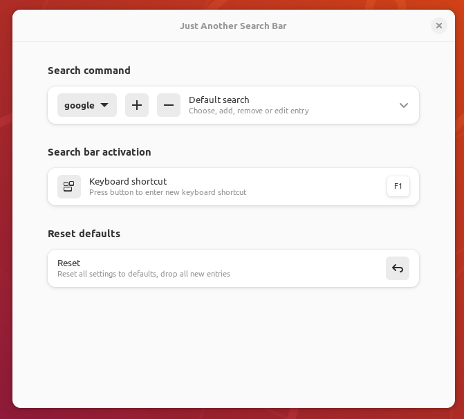
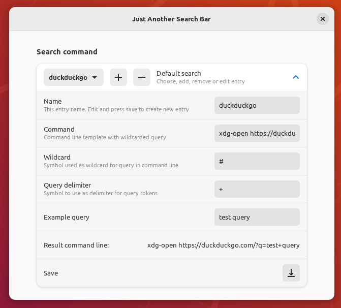

# Just Another Search Bar


Simple GNOME Shell extension for performing search queries from desktop. Some search engines are added as examples, you can add your own, including local search tools with suitable CLI.

It can also be used as a launcher for any user commands and scripts that require additional text input ([notification example](./img/prefs3.png)).

To **open** click on the search icon on the menu bar or press `Ctrl+Alt+F`

## Example

Open preferences



To **remove** an entry:
- select entry in preferences and click `-` button.

To **add** an entry you can:
1. Click `+` button in preferences
2. Fill in the fields. For example, to add `duckduckgo`:
    - Name: `duckduckgo`
    - Command: `xdg-open https://duckduckgo.com/?q=#`
    - Wildcard: `#`
    - Query delimiter: `+`
3. Click `Save` button



Or you can select any existing entry, expand row, edit entry (including the field "Name"), click `Save` button. In this case existing entry will not be changed and new entry will be added.

To **change** an    entry:
- select existing entry, expand row, change fields (except the field "Name"), click `Save` button

## Install

- Install: 
    
    ```
    git clone https://github.com/xelad0m/just-another-search-bar & cd just-another-search-bar
    make install
    ```

- Uninstall:

    ```
    make uninstall
    ```

- Or just:

[](https://extensions.gnome.org/extension/5522/just-another-search-bar/)


## About

Tested on GNOME Shell 43, 44

Based on [Google Search](https://extensions.gnome.org/extension/1057/google-search/) extension